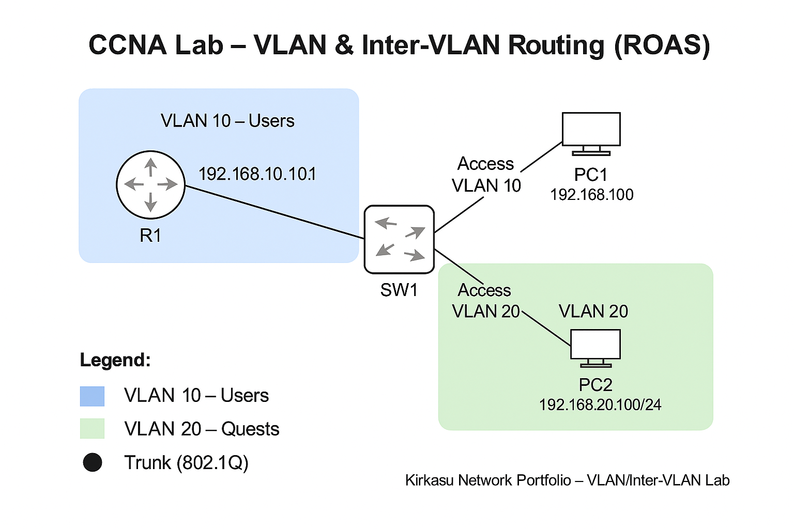

# VLAN & Inter-VLAN Routing (ROAS)

**Date Completed:** 2025-10-13  
**Devices:** IOSv (R1), IOSvL2 (SW1), Desktop (PC1 & PC2)  
**Exam Objectives:** CCNA 2.1, 2.2, 2.3  

---

## Objective
Implement VLAN segmentation (10 and 20) and configure Router-on-a-Stick on R1 to allow communication between VLANs.

---

## Topology


---

## IP Addressing
| VLAN | Subnet | Gateway | Host(s) |
|------|---------|----------|----------|
| 10 | 192.168.10.0/24 | 192.168.10.1 | PC1 (192.168.10.100) |
| 20 | 192.168.20.0/24 | 192.168.20.1 | PC2 (192.168.20.100) |

---

## Switch Configuration (SW1)
```bash
vlan 10
 name USERS10
vlan 20
 name USERS20
!
interface g0/1
 switchport mode access
 switchport access vlan 10
!
interface g0/2
 switchport mode access
 switchport access vlan 20
!
interface g0/0
 switchport mode trunk
 switchport trunk allowed vlan 10,20
```

---

## Router Configuration (R1)
```bash
interface g0/0
 no shutdown
!
interface g0/0.10
 encapsulation dot1Q 10
 ip address 192.168.10.1 255.255.255.0
!
interface g0/0.20
 encapsulation dot1Q 20
 ip address 192.168.20.1 255.255.255.0
```

---

## Verification
```bash
SW1# show interfaces trunk
Port        Mode         Encapsulation  Status        Native vlan
Gi0/1       on           802.1q         trunking      1

R1# show ip interface brief
Interface        IP-Address      OK? Method Status  Protocol
G0/0.10          192.168.10.1    YES manual up      up
G0/0.20          192.168.20.1    YES manual up      up

PC1> ping 192.168.20.100
Reply from 192.168.20.100: bytes=32 time<1ms TTL=128

```

✅ Successful inter-VLAN connectivity confirmed.

---

## Break/Fix Scenarios
- [VLAN 20 Missing from Trunk](breakfix/trunk_not_trunk.md)

---

## Evidence
Raw CLI captures and troubleshooting logs stored in:  
- [captures/](captures/)  
- [captures/troubleshooting/](captures/troubleshooting/)
