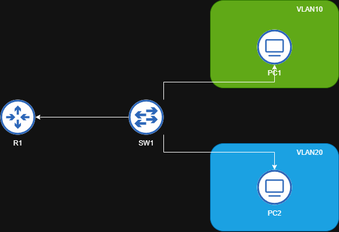

# VLAN Inter-VLAN Routing Project

## 🧠 Overview
This project demonstrates **Inter-VLAN Routing** in a small routed network using Cisco Modeling Labs (CML).
It includes baseline connectivity, configuration files, verification outputs, and several **Break/Fix** scenarios.

---

## 🗺️ Topology Diagram


**Devices:**
- R1 – Router-on-a-stick for inter-VLAN routing
- SW1 – Layer 2 switch handling VLAN segmentation
- PC1, PC2 – Workstations in different VLANs

**VLANs:**
| VLAN | Name | Subnet |
|------|------|---------|
| 10 | Sales | 192.168.10.0/24 |
| 20 | Engineering | 192.168.20.0/24 |

---

## ⚙️ Configuration Files
Configurations for R1 and SW1 are stored under `/configs`.

| Device | File |
|--------|------|
| R1 | [r1_running_config.txt](configs/r1_running_config.txt) |
| SW1 | [sw1_running_config.txt](configs/sw1_running_config.txt) |

---

## 📸 Captures
These files demonstrate verification commands and testing results.

| Purpose | Example File |
|----------|---------------|
| VLAN verification | [sw1_show_vlan_2025-10-13.txt](captures/sw1_show_vlan_2025-10-13.txt) |
| Trunk verification | [sw1_show_trunk_2025-10-13.txt](captures/sw1_show_trunk_2025-10-13.txt) |
| IP verification | [r1_show_ip_brief_2025-10-13.txt](captures/r1_show_ip_brief_2025-10-13.txt) |
| PC connectivity | [pc1_ping_pc2_2025-10-13.txt](captures/pc1_ping_pc2_2025-10-13.txt) |

---

## 🧩 Break/Fix Scenarios
This lab includes several troubleshooting exercises simulating common Layer 2/3 misconfigurations.

| # | Issue | Description | File |
|---|--------|--------------|------|
| 1 | **Trunk Port Left as Access** | SW1→R1 uplink misconfigured as an access port, breaking inter-VLAN routing. | [trunk_not_trunk.md](breakfix/trunk_not_trunk.md) |
| 2 | **Native VLAN Mismatch** | Different native VLANs configured on trunk interfaces between SW1 and R1. | [native_vlan_mismatch.md](breakfix/native_vlan_mismatch.md) |
| 3 | **Access Port in Wrong VLAN** | PC assigned to incorrect VLAN, resulting in loss of connectivity. | [access_port_wrong_vlan.md](breakfix/access_port_wrong_vlan.md) |
| 4 | **Router Interface Down** | R1 physical interface shutdown or cable disconnected, preventing gateway reachability. | [router_phy_down.md](breakfix/router_phy_down.md) |

Each scenario includes:
- **Problem Description**
- **Symptoms**
- **Verification Commands**
- **Fix Implemented**
- **Post-Fix Verification Output**

---

## 📂 Folder Structure

```
projects/vlan-intervlan-routing/
 ├── breakfix/
 │    ├── access_port_wrong_vlan.md
 │    ├── native_vlan_mismatch.md
 │    ├── router_phy_down.md
 │    ├── trunk_not_trunk.md
 ├── captures/
 ├── configs/
 ├── diagram/
 └── README.md
```

---

## ✅ Summary
This project demonstrates not just functional configuration but also **methodical documentation and troubleshooting**.
Each Break/Fix reinforces understanding of VLAN trunks, access ports, inter-VLAN routing, and Layer 2 vs Layer 3 separation.
